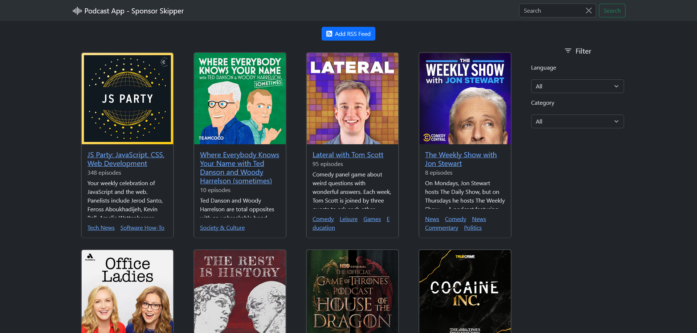
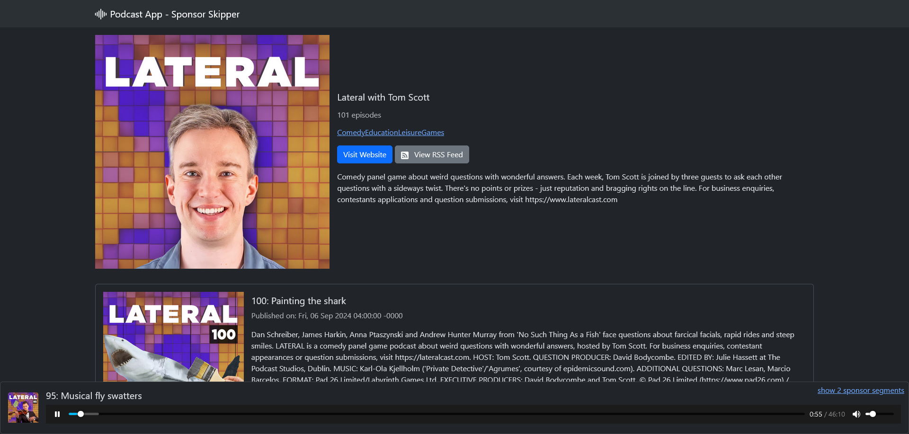

<p align="center"></p>

<h2 align="center"><b>Podcast App - Sponsor Skipper - Backend</b></h2>

This project is the backend for the Podcast App - Sponsor Skipper.

**Podcast App - Sponsor Skipper** is an Android App, designed to enhance your podcast listening experience by allowing you to skip
over sponsor segments effortlessly. With community-driven contributions, you can enjoy uninterrupted
content, making your podcast time more enjoyable.

How does it work?

Users can tag unwanted sponsor segments and advertisements. These tagged segments will be sent to the backend, that processes the data and distributes it to all other users. The segments can be rated by other users to improve the quality of the overall system.

The backend also serves a website where users can search, add and listen to podcast in the database. Additionally, admins can view some extra information about users, podcast and sponsor segments.

# Table of Contents

1. [Screenshots](#screenshots)
2. [Getting Started](#getting-started)
    1. [Prerequisites](#prerequisites)
    2. [Setup the Project](#setup-the-project)
    3. [Start the Backend](#start-the-backend)
    4. [Manage Users and Data](#manage-users-and-data)
3. [Project Overview](#project-overview)

# Screenshots

<p align="center">
    
    
</p>

# Getting Started

## Prerequisites

This project requires you to download and [install Node.js and npm](https://nodejs.org/en/download/package-manager). It was developed and tested using Node version v20.11.1.

The project also requires a PostgreSQL database. The simples way to use one is to [install Docker and Docker-Compose](https://docs.docker.com/compose/install/).

## Setup the Project

To install all dependencies run:

```
npm install
```

To configure the PostgreSQL connection create a `.env`-file in the root folder with the following content:

```
PORT=80
POSTGRES_DB=podcastdb
POSTGRES_HOST=localhost
POSTGRES_PORT=5432
POSTGRES_USER=postgres
POSTGRES_PASSWORD=password
```

The `PORT` is used by the webserver to serve its API and website.
The other values are the PostgreSQL connection, you should change the user and password.

To change the user and password of the PostgreSQL db you also have to adjust the values in the `docker/docker-compose.yml`:

```
environment:
    POSTGRES_DB: podcastdb
    POSTGRES_USER: postgres
    POSTGRES_PASSWORD: password
ports:
    - "5432:5432"
```

## Start the Backend

To start the PostgreSQL database, first start the docker demon (e.g., by starting Docker Desktop), then run:

```
cd docker
docker compose up -d
cd ..
```

To start the node server, wait till the database is up and running, then run:

```
npm run clean-start
```

Now the server should start and print the following message when ready:

```
[s]: Started server at http://127.0.0.1:80
```

## Manage Users and Data

If you want to give a user the admin permission you can adjust the data in the database.

```
docker exec -it docker-db-1 psql -U postgres -d podcastdb
```

Now you are connected to the database and can run SQL queries. For example:

```
\dt
```

This will show the tables in the database. When everything works correctly you should the following output:

```
 Schema |            Name             | Type  |  Owner
--------+-----------------------------+-------+----------
 public | category                    | table | postgres
 public | duration                    | table | postgres
 public | podcast                     | table | postgres
 public | podcast_categories_category | table | postgres
 public | rating                      | table | postgres
 public | sponsor_section             | table | postgres
 public | user                        | table | postgres
```

You can list all user with the following query:

```
SELECT * FROM "user";
```

To change the role of a user you can run:

```
UPDATE "user" SET role = <role_nr> WHERE id = <id>;
```

Replace `<id>` with te id of the user you want to update and `<role_nr>` with the role:

-   DEFAULT = 0
-   BANNED = 1
-   MODERATOR = 2
-   ADMIN = 3

# Project Overview

The project structure includes the following main directories and files:

-   `docker/`: Contains Docker-related files for containerization.
-   `public/`: Stores static assets like images, HTML, CSS and JavaScript files that will be served.
-   `src/`: Contains the main source code, for the backend logic.
-   `Configuration Files`: .gitignore, eslint.config.js, package.json, package-lock.json, tsconfig.json for managing dependencies, configurations, and TypeScript settings.

The main project is a **TypeScript** **Node.js** application utilizing **Express** for handling HTTP requests and **TypeORM** for interacting with databases.

The API endpoints are registered in the `routes.ts` file. Each endpoint corresponds to a specific _controller_ method (in the `controller/`-folder), which is responsible for handling HTTP requests and responses. Controller interact with _service_ classes (in the `db/services/`-folder) which manage data and interact with the database.
